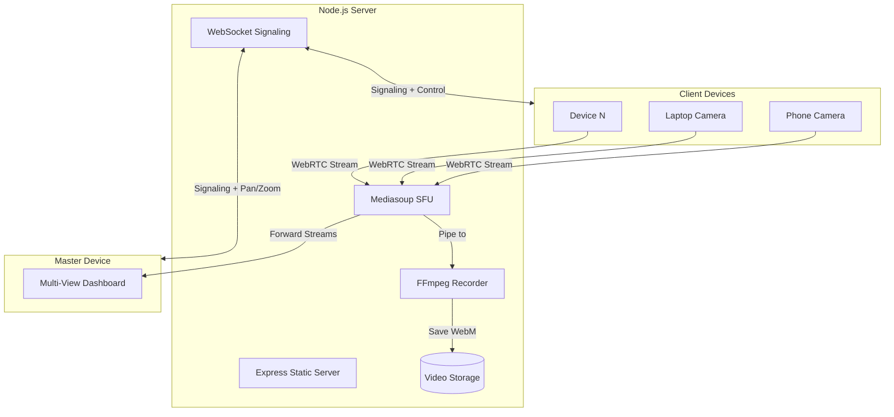

# LAN CCTV Video Monitoring Application

## Architecture Overview




## Project Structure

```javascript
lan-cctv/
├── package.json
├── server/
│   ├── index.js                 # Main Express server
│   ├── config.js                # Mediasoup & server config
│   ├── mediasoup.js             # Mediasoup router/transport setup
│   ├── websocket.js             # WebSocket signaling handler
│   ├── recorder.js              # FFmpeg recording logic
│   └── recordings/              # Stored video files
├── public/
│   ├── index.html               # Landing page (role selection)
│   ├── master.html              # Master multi-view dashboard
│   ├── device.html              # Camera streaming page
│   ├── css/
│   │   └── styles.css           # Dark theme UI styles
│   └── js/
│       ├── common.js            # Shared WebSocket/WebRTC utils
│       ├── master.js            # Master dashboard logic
│       └── device.js          # Camera capture and streaming
└── README.md
```


## Implementation Details

### 1. Server Setup (`server/index.js`)

- Express server serving static files from `/public`
- HTTP server for WebSocket upgrade
- Initialize mediasoup Worker and Router
- Bind to `0.0.0.0` for LAN accessibility
- Display local IP addresses on startup for easy device connection

### 2. Mediasoup Configuration (`server/mediasoup.js`)

- Create mediasoup Worker with appropriate settings
- Configure Router with VP8/VP9/H264 video codecs and Opus audio
- Handle Producer/Consumer transports per client
- Support high bitrate (up to 10Mbps) for quality streaming
- Implement PlainRtpTransport for FFmpeg recording pipeline

### 3. WebSocket Signaling (`server/websocket.js`)

- Handle client registration (streamer vs master)
- Relay mediasoup signaling: `createTransport`, `produce`, `consume`
- Broadcast new/disconnected streamers to master
- Handle pan/zoom commands from master to specific streamers
- Track active streamers with metadata (device name, stream ID)

### 4. Recording System (`server/recorder.js`)

- Use mediasoup PlainRtpTransport to pipe RTP to FFmpeg
- Record each stream as Mp4(best supported in macbook) (VP8/VP9 + Opus)
- Filename format: `{deviceId}_{timestamp}.mp4`
- Auto-create recordings directory
- Handle graceful stop on stream end

### 5. Frontend: Streamer Page (`public/device.html`, `public/js/device.js`)

- Get user media with high quality constraints:
  ```javascript
    { video: { width: { ideal: 1920 }, height: { ideal: 1080 }, 
               frameRate: { ideal: 30 } }, audio: true }
  ```

- Connect to WebSocket, create mediasoup transport, produce tracks
- Listen for pan/zoom commands and apply via `MediaStreamTrack.applyConstraints()`
- Display local preview with device name input
- Show connection status indicator

### 6. Frontend: Master Dashboard (`public/master.html`, `public/js/master.js`)

- Grid layout showing all active streams as tiles
- Click tile to expand to full view, click again to return to grid
- Consume all producer streams via mediasoup
- Pan/zoom controls visible in expanded view:
- Zoom slider (sends constraint to streamer)
- Pan buttons for PTZ-capable cameras (or digital crop fallback)
- Display device name overlay on each tile
- Auto-add/remove tiles as streamers join/leave

### 7. Pan/Zoom Implementation

- **Optical zoom**: Use `track.applyConstraints({ advanced: [{ zoom: value }] })` if device supports
- **Digital zoom fallback**: CSS `transform: scale()` on video element with overflow hidden
- **Pan**: For PTZ cameras use constraints, otherwise digital pan via CSS `transform: translate()`
- Master sends commands via WebSocket, server relays to specific streamer

### 8. UI Design (`public/css/styles.css`)

- Dark theme with deep charcoal background (#1a1a2e)
- Accent color: electric cyan (#00d9ff)
- Monospace font for technical feel (JetBrains Mono or Fira Code)
- Grid layout with subtle glow on active streams
- Smooth transitions for tile expand/collapse
- Responsive design for various screen sizes

## Key Technical Notes

1. **LAN Discovery**: Server prints local IP on startup; clients connect via `http://{server-ip}:3000`
2. **No TURN/STUN needed**: On LAN, direct connections work; we only need signaling
3. **Codec Priority**: H264 preferred for compatibility, VP9 for quality when supported
4. **Recording Format**: WebM container with VP8/Opus for broad playback support
5. **Bitrate**: Configure mediasoup for high bitrate (5-10 Mbps) since LAN bandwidth is abundant

## Dependencies

```json
{
  "dependencies": {
    "express": "^4.18.2",
    "ws": "^8.14.2",
    "mediasoup": "^3.13.0",
    "uuid": "^9.0.0"
  }
}
```